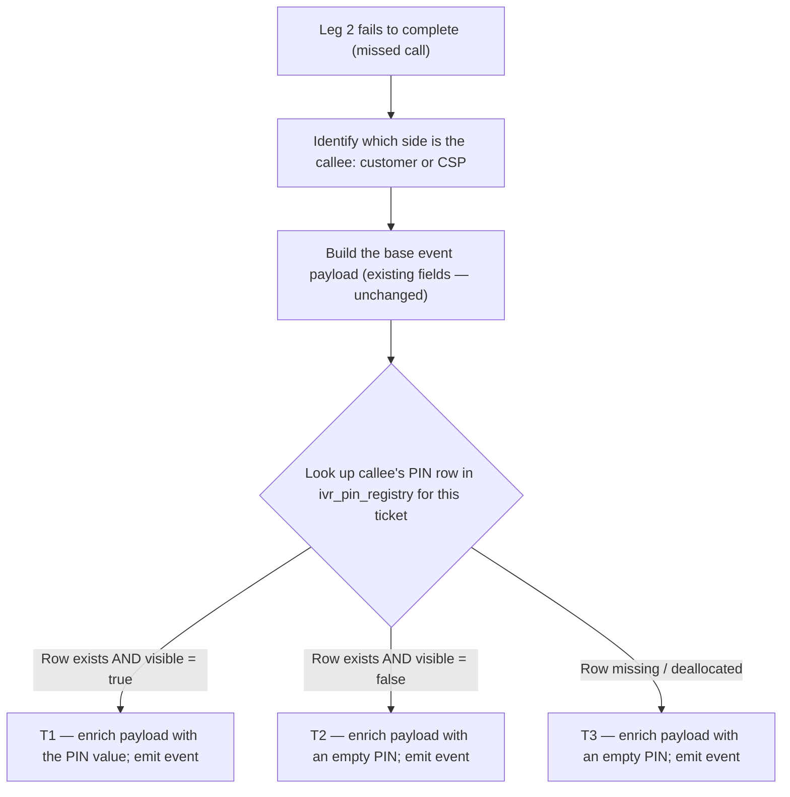

# IVR Missed Call Alert — add PIN to the callback SMS

| | | | |
|---|---|---|---|
| **Owner** — Ashish Raj (PM, IVR) | **Reviewer** — Rahul ⚠️ *AI GENERATED — review* | **Status** — Draft | **Sign-off** — Pending |
| **Version** — v0.1 · 2026-09-10 | **Consulted — IVR Eng** — Rahul ⚠️ *AI GENERATED — review* | **Consulted — CRM/CleverTap** — TBD ⚠️ *AI GENERATED — review* | |

---

## 1. Objective & Definition of Success

**Context.** This spec is an extension of the **IVR 2.0** feature (see §8). It applies when a caller dials the **IVR masked number**, the counterparty fails to pick up, and IVR fires a missed-call alert into CleverTap for the counterparty's app (Customer App or CSP / Technician App).

**Objective.** When a callee misses a call on the IVR masked number, they receive an SMS that contains both the number to call back on and the PIN to enter — so they can complete the callback in one shot without hunting for the PIN in their chat / ticket card.

**How this PRD contributes.** This PRD does one narrow thing: add the callback PIN to the two existing CleverTap missed-call events so the downstream SMS campaign has the PIN to bind to. The SMS campaign template, DLT copy, delivery rules and CleverTap journey configuration are downstream of this spec and out of scope (§8).

**Boundary.** This spec governs the payload of two named CleverTap events emitted by the IVR service. It adds one field to each event; nothing else changes. Explicitly out of scope: (i) the SMS content / template / DLT registration; (ii) the trigger conditions of the events themselves (when and whether they fire); (iii) any push-notification behaviour; (iv) any other CleverTap event; (v) any change to the `ivr_pin_registry` table or how PINs are generated / visible; (vi) any UI change on either app. If this ships and an existing consumer of these two events breaks because a previously-present field is missing or renamed, that broke (AC-REG-1).

### Guardrails — promises that hold on every path

| ID | Guardrail | One line | Anchors |
|---|---|---|---|
| G1 | **Existing event contract preserved** | Every field the two events carry today is still present, with the same name, type and semantics. This spec is additive only. | R1 · AC-REG-1 · MQ-3 |
| G2 | **IVR 2.0 functionality preserved** | The trigger conditions of the missed-call events, the push-notification pipeline, and every other IVR 2.0 behaviour continue to work exactly as they do today. This spec is a pure payload extension. | R1 · AC-REG-1 · AC-REG-2 · MQ-3 |
| G3 | **PIN visibility is respected** | If the ticket's `ivr_pin_registry` row is not marked visible to the recipient app (per the IVR 2.0 cohort visibility flag), the PIN field is not populated — the event still fires but carries an empty PIN. | R2 · AC-VIS-1 · MQ-4 |

### Success metrics

| ID | Metric | Baseline | Target | Source |
|---|---|---|---|---|
| M1 | Missed-call → successful bridged callback rate — of calls that miss on Leg 2, the share where the same missed callee dials the IVR masked number within 30 minutes and successfully bridges. | ⚠️ *AI GENERATED — review* *(needs measurement — establish baseline in the two weeks before the downstream SMS goes live)* | +5 pp lift over baseline ⚠️ *AI GENERATED — review* *(target is the SMS campaign's uplift once wired end-to-end)* | MQ-1 |

**Invariant (not a metric):** G1 broken-consumer incidents = 0, zero tolerance. Monitored via MQ-3, not trended.

---

## 2. User Stories & Rules

| ID | Story | MUST | MUST NOT |
|---|---|---|---|
| R1 | As a customer or CSP user who missed a call about my active ticket, I want the callback SMS to include the PIN alongside the callback number so I can dial back in one shot. | **(a)** Include the callee's own PIN in the event payload — `customer_pin` on the customer-side event, `csp_pin` on the CSP-side event — sourced from `ivr_pin_registry` for the ticket the missed call was about. **(b)** Fire the event within the same latency envelope as today — no change to event trigger, timing or firing conditions. | Add, rename or remove any existing field on either event. Change any observable event behaviour beyond the PIN payload addition. |
| R2 | As IVR Ops, I want the PIN in the event to respect the ticket's visibility flag so we don't leak a PIN to a callee whose ticket has PIN-visibility switched off. | **(a)** When the ticket's `ivr_pin_registry` row has `visible = false`, populate the PIN field as an empty string (or the platform's null equivalent). The event itself still fires. **(b)** When the ticket has no active `ivr_pin_registry` row for the required side, populate the PIN field as empty. | Suppress the missed-call event or change its firing conditions based on PIN visibility — the event's role today is broader than the PIN and must continue firing regardless. |

---

## 3. System Behaviour

Lifecycle of the **missed-call event payload** (the JSON body of a `dnp_customer_missed_call_alert` or `call_dnp_missed_call_alert` event, constructed by the IVR service at the moment Leg 2 fails). Neighbouring lifecycles — the call session on Exotel, the push-notification cascade downstream of CleverTap, the SMS campaign — are out of scope.

### 3a. System flow chart

**Precedence:** none — this is a linear enrichment chain evaluated once per event, per call. Concurrent events for different calls are independent.

### 3b. State transition table — canon

| ID | From | Action / Trigger | Rule / Check | To | Side-effects |
|---|---|---|---|---|---|
| T1 | — | Leg 2 fails to complete, callee's `ivr_pin_registry` row exists and `visible = true` | — | Event emitted with populated PIN | The relevant event (`dnp_customer_missed_call_alert` for customer-side callee; `call_dnp_missed_call_alert` for CSP-side callee) is emitted to CleverTap. Payload = today's fields + one new field: `customer_pin` (customer-side event) or `csp_pin` (CSP-side event), sourced from `ivr_pin_registry.pin`. (R1a, G1) |
| T2 | — | Leg 2 fails, callee's `ivr_pin_registry` row exists and `visible = false` | — | Event emitted with empty PIN | Event emitted as in T1, but the PIN field is an empty string. All other fields are unchanged. (R2a, G3) |
| T3 | — | Leg 2 fails, callee's `ivr_pin_registry` row is missing or already deallocated | — | Event emitted with empty PIN | Event emitted as in T1, but the PIN field is an empty string. (R2b) |

---

## 4. Screen Requirements

**Experience intent:** none — this is a backend-only change to a CleverTap event payload. No screens are added, changed or removed by this spec. The user-visible SMS that consumes the new PIN field is out of scope (§1 Boundary); its copy and format live in the downstream CleverTap campaign configuration.

---

## 5. Configurability

No new parameters are introduced by this spec. The behaviour is deterministic once the payload change is deployed: PIN is enriched from `ivr_pin_registry` based on the visibility flag, per T1 / T2 / T3.

---

## 6. Measurement

| ID | The system must be able to answer… | Feeds |
|---|---|---|
| MQ-1 | Of calls that miss on Leg 2, the share where the same missed callee dials the IVR masked number within 30 minutes and successfully bridges — split by cohort (before and after the SMS campaign goes live). | M1 |
| MQ-2 | Of missed-call events emitted, how many carry a populated PIN vs an empty PIN — split by event name (customer / CSP) and by reason for empty (visible = false vs row missing vs row deallocated). | Diagnostic — sizes the PIN-visibility gap and any data-quality issues at emit time. |
| MQ-3 | For every missed-call event emitted, whether the full set of fields present pre-change is still present and unchanged. | G1 invariant · G2 |
| MQ-4 | For every missed-call event with an empty PIN, whether the underlying `ivr_pin_registry` state at emit time genuinely warranted an empty PIN (visible = false, or row missing / deallocated). | G3 |

---

## 7. Acceptance Criteria

### EVT — Event enrichment (T1, T2, T3)

| AC | Given / When / Then | Verifies | Status |
|---|---|---|---|
| AC-EVT-1 | **Given** an active ticket where the customer's `ivr_pin_registry` row has `pin = 234491`, `visible = true`, **When** a CSP calls the customer through the IVR masked number and the customer does not pick up on Leg 2, **Then** the `dnp_customer_missed_call_alert` event is emitted to CleverTap with all existing fields plus a new field `customer_pin = "234491"`. | R1a · T1 · G1 | Settled |
| AC-EVT-2 | **Given** an active ticket where the CSP's `ivr_pin_registry` row has `pin = 087275`, `visible = true`, **When** a customer calls the CSP through the IVR masked number and the CSP does not pick up on Leg 2, **Then** the `call_dnp_missed_call_alert` event is emitted to CleverTap with all existing fields plus a new field `csp_pin = "087275"`. | R1a · T1 · G1 | Settled |
| AC-EVT-3 | **Given** the setup of AC-EVT-1, **When** the event is received on CleverTap, **Then** the `customer_pin` value in the event payload is byte-for-byte identical to `ivr_pin_registry.pin` for the CUSTOMER-type row of the ticket the missed call was about — read at the moment the event was constructed. | R1a · T1 | Settled |

### VIS — Visibility flag (T2)

| AC | Given / When / Then | Verifies | Status |
|---|---|---|---|
| AC-VIS-1 | **Given** an active ticket where the customer's `ivr_pin_registry` row has `visible = false` (non-cohort), **When** the customer misses the call, **Then** the `dnp_customer_missed_call_alert` event is emitted with `customer_pin = ""` (empty string). All other fields are present and populated as they are today. | R2a · G3 · T2 | Settled |
| AC-VIS-2 | **Given** the CSP-side equivalent — CSP row `visible = false`, **When** the CSP misses the call, **Then** the `call_dnp_missed_call_alert` event is emitted with `csp_pin = ""`. | R2a · G3 · T2 | Settled |

### EDGE — Edge cases (T3)

| AC | Given / When / Then | Verifies | Status |
|---|---|---|---|
| AC-EDGE-1 | **Given** an active ticket where no `ivr_pin_registry` row exists for the callee's side at the moment the event fires (data anomaly), **When** the callee misses the call, **Then** the event is still emitted; the PIN field is populated as an empty string; no exception is thrown; no other field is affected. | R2b · T3 · G2 | Settled |
| AC-EDGE-2 | **Given** an active ticket where the callee's `ivr_pin_registry` row has been deallocated between the call and the event-emit moment (racy but possible), **When** the callee misses the call, **Then** the event fires with `customer_pin` / `csp_pin` as an empty string. | R2b · T3 · G2 | Settled |

### REG — Regression

| AC | Given / When / Then | Verifies | Status |
|---|---|---|---|
| AC-REG-1 | **Given** a missed call under any scenario covered above, **When** the CleverTap event is emitted, **Then** every field that the event carried before this spec is still present in the payload with the same name, type and semantics; the new PIN field is the only addition. | G1 · G2 | Settled |
| AC-REG-2 | **Given** any missed call, **When** the event fires, **Then** the trigger condition, timing envelope, and destination of the event are unchanged from today; the push-notification pipeline downstream of CleverTap continues to fire as it does today. | G2 | Settled |

### WF — Workflow (end-to-end)

| AC | Given / When / Then | Verifies | Status |
|---|---|---|---|
| AC-WF-1 | **Given** a customer with an active Restore ticket, `customer_pin = 234491`, `visible = true`, **When** a CSP calls the customer through the IVR masked number and the customer misses it, **Then** the `dnp_customer_missed_call_alert` event carrying `customer_pin = "234491"` reaches CleverTap; the downstream SMS campaign (out of scope) can bind to `customer_pin` and deliver the SMS with both the callback number and the PIN. | R1a · T1 · G1 · G2 | Settled |

---

## 8. Glossary

| Term | Meaning | Owner (domain) |
|---|---|---|
| IVR 2.0 | The parent feature this spec extends. IVR 2.0 introduced the single masked-number architecture with PIN-based authentication and multi-number rollover. This spec adds one field to two of IVR 2.0's CleverTap events. | IVR |
| IVR masked number | The single Wiom-owned DID that both customers and CSPs dial to reach each other through IVR 2.0. | IVR |
| Missed-call event | **Canonical definition:** the CleverTap event fired by the IVR service when Leg 2 of a bridge attempt fails to complete (callee does not pick up). Two variants exist, keyed by which app the callee uses: `dnp_customer_missed_call_alert` (customer-app callee) and `call_dnp_missed_call_alert` (CSP-app callee). | IVR |
| Callback PIN | The PIN value from `ivr_pin_registry` for the callee's own side of the ticket. When the callee dials the IVR masked number and enters this PIN, IVR 2.0 bridges them to the counterparty they missed the call from. | IVR |
| PIN visibility flag | Shorthand for the `visible` column on `ivr_pin_registry`. When `true`, the PIN may be exposed to the callee's app / SMS surface. When `false` (non-cohort ticket), the PIN must not be exposed downstream. | IVR |
| SMS campaign | The CleverTap-configured campaign that consumes the missed-call event and dispatches an SMS to the callee. Content, template, DLT registration and delivery rules of this SMS are out of scope of this PRD — this PRD's job is only to ensure the event payload carries the PIN the campaign needs to bind to. | CRM |

---

## 9. Notes for System Capabilities

What the platform must be able to do for this feature to exist. Whether these are one system or several, and how they interact, is the implementer's design.

| Capability | Needed by |
|---|---|
| At the moment a missed-call event is constructed, read the callee-side row in `ivr_pin_registry` for the ticket the call was about (customer-type row for the customer event; CSP-type row for the CSP event). | T1 · T2 · T3 · R1a |
| Include the PIN value (or an empty string) as a new field on the event payload — `customer_pin` on the customer event, `csp_pin` on the CSP event — without altering any existing field. | T1 · T2 · T3 · R1a · G1 |
| Respect the `visible` flag when populating the PIN field: `false` → empty string; `true` → the actual PIN value. | T2 · R2a · G3 |
| Fire the event with an empty PIN field when the row is missing or deallocated, rather than raising an error or suppressing the event. | T3 · R2b · G2 |
| Emit diagnostic telemetry that distinguishes empty-PIN reasons (visible=false vs row missing vs row deallocated) so operations can size PIN-visibility gaps and data-quality issues. | MQ-2 · MQ-4 |

---

## AI-generated content for review

| Location | What was generated | Basis |
|---|---|---|
| Header · Reviewer | "Rahul" | Copied from the sibling IVR PRD (Retry Count) — assumes same eng owner; PM to confirm |
| Header · Consulted — IVR Eng | "Rahul" | Same as above — confirm |
| Header · Consulted — CRM/CleverTap | "TBD" | No CRM contact named yet; PM to fill in whoever owns the SMS campaign configuration downstream |
| §1 M1 baseline (empty / needs measurement) | Left as "needs measurement" with a note to establish baseline before the SMS campaign goes live | Baseline hasn't been captured; recommend a 2-week measurement window before the campaign lights up |
| §1 M1 target (+5 pp) | Speculative target — modest lift over baseline as a first proof point | Confirm — the target depends on the SMS campaign copy quality (out of scope), so this is a placeholder |
