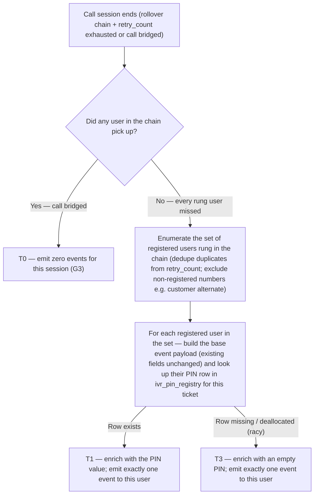

# IVR Missed Call Alert — add PIN to the callback SMS

| | | | |
|---|---|---|---|
| **Owner** — Ashish Raj (PM, IVR) | **Reviewer** — Rahul ⚠️ *AI GENERATED — review* | **Status** — Draft | **Sign-off** — Pending |
| **Version** — v0.3 · 2026-09-11 | **Consulted — IVR Eng** — Rahul ⚠️ *AI GENERATED — review* | **Consulted — CRM/CleverTap** — TBD ⚠️ *AI GENERATED — review* | |

---

## 1. Objective & Definition of Success

**Context.** This spec is an extension of the **IVR 2.0** feature (see §8). It applies when a caller dials the **IVR masked number**, the counterparty fails to pick up on the full rollover chain, and a missed-call alert event gets fired on CleverTap for the counterparty's app (Customer App or CSP / Technician App).

**Objective.** When a call misses, every registered user who was rung and did not answer receives an SMS that contains both the number to call back on and their own PIN to enter — so they can complete the callback in one shot without hunting for the PIN in their chat / ticket card.

**How this PRD contributes.** This PRD does two things: (i) add the callback PIN to the two existing CleverTap missed-call events so the downstream SMS campaign has the PIN to bind to, and (ii) pin down the recipient-scope rules for those events so the rollover chain (Sept 2 release) and the `retry_count` duplication (see [[ivr-retry-count-prd]]) never fire the event more than once per registered user per call session — and never at all if anyone in the chain answered. The SMS campaign template, DLT copy, delivery rules and CleverTap journey configuration are downstream of this spec and out of scope (§8).

**Recipient scope — canonical.** Fires only after the call session ends. A call session is one caller-initiated dial of the IVR masked number, including its full rollover chain and any `retry_count` duplication.
- **Only if no one answered.** If any user in the rollover chain picked up, no missed-call event fires for that session.
- **One event per registered user, once per session.** For each user in the rollover chain who was rung and did not pick up, exactly one event fires. The event lands on that user's registered mobile number for the receiving app — customer-side event to the customer's registered number, CSP-side event to the CSP user's registered number.
- **Alternate numbers do not receive an event.** The customer's alternate number and any other non-app-registered number in the rollover chain are not recipients of a CT event — those numbers have no app install to fire into.
- **`retry_count` never multiplies events.** Duplicate entries in the Exotel numbers array (`retry_count > 0`) do not cause additional emissions. The session emits once per registered user, whether that user was rung once, twice or three times inside the session.

**Boundary.** This spec governs (i) the payload of two named CleverTap events (`dnp_customer_missed_call_alert`, `call_dnp_missed_call_alert`) fired at end of a call session per §3, and (ii) the recipient-scope rules above. Explicitly out of scope: (a) the SMS content / template / DLT registration; (b) the internal mechanics of the rollover chain and `retry_count` themselves — those live in IVR 2.0 and [[ivr-retry-count-prd]]; (c) any push-notification behaviour beyond firing; (d) any other CleverTap event; (e) any change to the `ivr_pin_registry` table or how PINs are generated / visible; (f) any UI change on either app. If this ships and an existing consumer of these two events breaks because a previously-present field is missing or renamed, that broke (AC-REG-1).

### Guardrails — promises that hold on every path

| ID | Guardrail | One line | Anchors |
|---|---|---|---|
| G1 | **Existing event contract preserved** | Every field the two events carry today is still present, with the same name, type and semantics. This spec is additive only. | R1 · AC-REG-1 · MQ-3 |
| G2 | **IVR 2.0 functionality preserved** | The trigger conditions of the missed-call events, the push-notification pipeline, and every other IVR 2.0 behaviour continue to work exactly as they do today. This spec is a pure payload extension. | R1 · AC-REG-1 · AC-REG-2 · MQ-3 |
| G3 | **One event per registered user per call session, never on pickup** | Rollover and `retry_count` never multiply events. A call where any user answered fires zero events; a call where no one answered fires exactly one event per registered user in the rollover chain. | R3 · AC-SCOPE-1 · AC-SCOPE-2 · AC-SCOPE-3 · AC-SCOPE-4 · AC-SCOPE-5 · MQ-4 |

### Success metrics

| ID | Metric | Baseline | Target | Source |
|---|---|---|---|---|
| M1 | Missed-call → successful bridged callback rate — of calls that miss on Leg 2, the share where the same missed callee dials the IVR masked number within 30 minutes and successfully bridges. | ⚠️ *AI GENERATED — review* *(needs measurement — establish baseline in the two weeks before the downstream SMS goes live)* | +5 pp lift over baseline ⚠️ *AI GENERATED — review* *(target is the SMS campaign's uplift once wired end-to-end)* | MQ-1 |

**Invariant (not a metric):** G1 broken-consumer incidents = 0, zero tolerance. Monitored via MQ-3, not trended.

---

## 2. User Stories & Rules

| ID | Story | MUST | MUST NOT |
|---|---|---|---|
| R1 | As a customer or CSP user who missed a call about my active ticket, I want the callback SMS to include the PIN alongside the callback number so I can dial back in one shot. | **(a)** Include the callee's own PIN in the event payload — `customer_pin` on the customer-side event, `csp_pin` on the CSP-side event — sourced from `ivr_pin_registry` for the ticket the missed call was about. **(b)** Fire the event within the same latency envelope as today — no change to event trigger, timing or firing conditions. | Add, rename or remove any existing field on either event. Change any observable event behaviour beyond the PIN payload addition. |
| R2 | As IVR Ops, I want the missed-call event to fire resiliently even on the racy edge where the callee's `ivr_pin_registry` row has been deallocated or is missing between call start and event emission, so downstream stays informed of the miss rather than losing the alert. | **(a)** When no active `ivr_pin_registry` row exists for the callee's side at emit time, still fire the event; populate the PIN field as an empty string; do not raise. **(b)** When the row was deallocated between the call and the event-emit moment (racy), same behaviour: fire with empty PIN. | Suppress or crash the event because the PIN row cannot be read. Change any other field on the event to signal the empty-PIN condition — the field is simply empty. |
| R3 | As a user who missed the call, I want one callback SMS for that call — not several. | **(a)** Evaluate event emission once per call session, at end of session. A session includes the full rollover chain and any `retry_count` duplication. **(b)** If any user in the chain answered, emit zero events for the session. **(c)** If no user answered, emit exactly one event per registered user in the rollover chain, each targeting that user's registered mobile number for the receiving app. **(d)** `retry_count > 0` and the presence of duplicate entries in the numbers array must not cause additional emissions. | Fire an event to any non-registered number in the rollover chain (e.g. the customer's alternate number, or a hand-typed number without an app install). Fire more than once per registered user per call session. Fire when the call ultimately connected. |

---

## 3. System Behaviour

Lifecycle of the **missed-call event emission** for one call session (one caller-initiated dial of the IVR masked number, including its full rollover chain and any `retry_count` duplication). Neighbouring lifecycles — the call session on Exotel, the push-notification cascade downstream of CleverTap, the SMS campaign — are out of scope.

### 3a. System flow chart

**Precondition (assumed, not re-tested here).** This event only fires for IVR calls. An IVR call only happens when the ticket's PIN is visible to the recipient app (per the IVR 2.0 cohort visibility flag) — otherwise the call is routed through the normal (non-IVR) path and this event does not exist for that call. Therefore every emission path below assumes the visibility flag was `true` at call start. The visibility flag is not re-checked at emit time.

**Precedence:** T0 wins over T1 / T3. If T0 fires (any pickup), no per-user emission runs at all. Within a "no pickup" session, T1 and T3 are evaluated per registered user independently.

### 3b. State transition table — canon

| ID | From | Action / Trigger | Rule / Check | To | Side-effects |
|---|---|---|---|---|---|
| T0 | — | Call session ends and **at least one user in the rollover chain answered** | — | Zero events for this session | No missed-call event fires for this session, on either side. (R3b, G3) |
| T1 | — | Call session ends with no pickup; a registered user in the chain has an `ivr_pin_registry` row that exists | — | One event emitted to that user with populated PIN | The relevant event (`dnp_customer_missed_call_alert` for the customer-side callee's registered number; `call_dnp_missed_call_alert` for a CSP-side callee's registered number) is emitted to CleverTap **once for this user**. Payload = today's fields + one new field: `customer_pin` (customer-side event) or `csp_pin` (CSP-side event), sourced from `ivr_pin_registry.pin` for that user. Duplicate dial attempts on this user from `retry_count` do not add more emissions. (R1a, R3a, R3c, R3d, G1, G3) |
| T3 | — | Call session ends with no pickup; the user's `ivr_pin_registry` row is missing or has been deallocated between call start and event emission (racy) | — | One event emitted to that user with empty PIN | Event emitted as in T1, but the PIN field is an empty string. All other fields are unchanged. (R2a, R2b, G2) |
| T4 | — | Call session ends with no pickup; a number in the rollover chain has no registered app user behind it (e.g. the customer's alternate number, or a hand-typed number) | — | Zero events for that number | That number is silently excluded from the emission set. No event is directed at it. (R3c, R3 MUST NOT) |

---

## 4. Screen Requirements

**Experience intent:** none — this is a backend-only change to a CleverTap event payload. No screens are added, changed or removed by this spec. The user-visible SMS that consumes the new PIN field is out of scope (§1 Boundary); its copy and format live in the downstream CleverTap campaign configuration.

---

## 5. Configurability

No new parameters are introduced by this spec. The behaviour is deterministic once the payload change is deployed: PIN is enriched from `ivr_pin_registry` for each registered callee in the rollover chain, per T1 (row present) or T3 (row missing / deallocated — defensive edge).

---

## 6. Measurement

| ID | The system must be able to answer… | Feeds |
|---|---|---|
| MQ-1 | Of calls that miss on Leg 2, the share where the same missed callee dials the IVR masked number within 30 minutes and successfully bridges — split by cohort (before and after the SMS campaign goes live). | M1 |
| MQ-2 | Of missed-call events emitted, how many carry a populated PIN vs an empty PIN — split by event name (customer / CSP) and by reason for empty (row missing vs row deallocated). | Diagnostic — sizes any data-quality / race issues at emit time. |
| MQ-3 | For every missed-call event emitted, whether the full set of fields present pre-change is still present and unchanged. | G1 · G2 |
| MQ-4 | Per call session, the number of missed-call events emitted, broken down by side (customer / CSP) and by rollover-chain size. Expected: 0 if any user answered; otherwise exactly one event per registered user rung, regardless of `retry_count`. | G3 · R3 |

---

## 7. Acceptance Criteria

### EVT — Event enrichment (T1)

| AC | Given / When / Then | Verifies | Status |
|---|---|---|---|
| AC-EVT-1 | **Given** an active ticket where the customer's `ivr_pin_registry` row has `pin = 234491`, `visible = true`, **When** a CSP calls the customer through the IVR masked number and the customer does not pick up on Leg 2, **Then** the `dnp_customer_missed_call_alert` event is emitted to CleverTap with all existing fields plus a new field `customer_pin = "234491"`. | R1a · T1 · G1 | Settled |
| AC-EVT-2 | **Given** an active ticket where the CSP's `ivr_pin_registry` row has `pin = 087275`, `visible = true`, **When** a customer calls the CSP through the IVR masked number and the CSP does not pick up on Leg 2, **Then** the `call_dnp_missed_call_alert` event is emitted to CleverTap with all existing fields plus a new field `csp_pin = "087275"`. | R1a · T1 · G1 | Settled |
| AC-EVT-3 | **Given** the setup of AC-EVT-1, **When** the event is received on CleverTap, **Then** the `customer_pin` value in the event payload is byte-for-byte identical to `ivr_pin_registry.pin` for the CUSTOMER-type row of the ticket the missed call was about — read at the moment the event was constructed. | R1a · T1 | Settled |

### EDGE — Defensive edges (T3)

| AC | Given / When / Then | Verifies | Status |
|---|---|---|---|
| AC-EDGE-1 | **Given** an IVR-cohort ticket where no `ivr_pin_registry` row exists for the callee's side at the moment the event fires (data anomaly), **When** the callee misses the call, **Then** the event is still emitted; the PIN field is populated as an empty string; no exception is thrown; no other field is affected. | R2a · T3 · G2 | Settled |
| AC-EDGE-2 | **Given** an IVR-cohort ticket where the callee's `ivr_pin_registry` row has been deallocated between the call and the event-emit moment (racy but possible), **When** the callee misses the call, **Then** the event fires with `customer_pin` / `csp_pin` as an empty string. | R2b · T3 · G2 | Settled |

### SCOPE — Recipient scope (T0, T4, G3)

| AC | Given / When / Then | Verifies | Status |
|---|---|---|---|
| AC-SCOPE-1 | **Given** a customer-initiated call where the rollover chain rings Technician → Manager → Owner (3 registered CSP users) and **the Manager picks up on rollover step 2**, **When** the call session ends (bridged), **Then** zero `call_dnp_missed_call_alert` events fire for this session. Also zero on the customer side. | R3b · T0 · G3 | Settled |
| AC-SCOPE-2 | **Given** a customer-initiated call where the rollover chain rings Technician → Manager → Owner (3 registered CSP users), `retry_count = 0`, and **no one picks up on any of the 3 attempts**, **When** the call session ends, **Then** exactly three `call_dnp_missed_call_alert` events fire — one to each of Technician, Manager, Owner on their own registered mobile number — each with that user's own `csp_pin` per T1. The customer-side event does not fire. | R3c · T1 · G3 · MQ-4 | Settled |
| AC-SCOPE-3 | **Given** the setup of AC-SCOPE-2 but with `retry_count = 1` (numbers array has 6 entries — each of the 3 CSP users duplicated once), **When** none of the 6 dial attempts is picked up, **Then** exactly three `call_dnp_missed_call_alert` events fire — still one per registered user, not six, not two per user. | R3d · G3 · MQ-4 | Settled |
| AC-SCOPE-4 | **Given** a CSP-initiated call to a customer where the rollover chain is customer's primary number → customer's alternate number (2 numbers, 1 registered user — the customer — plus 1 alternate number that has no app install), and **neither number picks up**, **When** the call session ends, **Then** exactly one `dnp_customer_missed_call_alert` event fires — to the customer's registered mobile number — with `customer_pin` populated per T1. The alternate number receives no CT event (no app to fire into). | R3c · T4 · G3 | Settled |
| AC-SCOPE-5 | **Given** any missed call, **When** the same call session is inspected end-to-end, **Then** across all rollover steps and all `retry_count` duplications, no registered user in the chain receives more than one missed-call event for that session. | R3d · G3 · MQ-4 | Settled |

### REG — Regression

| AC | Given / When / Then | Verifies | Status |
|---|---|---|---|
| AC-REG-1 | **Given** a missed call under any scenario covered above, **When** the CleverTap event is emitted, **Then** every field that the event carried before this spec is still present in the payload with the same name, type and semantics; the new PIN field is the only addition. | G1 · G2 | Settled |
| AC-REG-2 | **Given** any missed call, **When** the event fires, **Then** the trigger condition, timing envelope, and destination of the event are unchanged from today; the push-notification pipeline downstream of CleverTap continues to fire as it does today. | G2 | Settled |

### WF — Workflow (end-to-end)

| AC | Given / When / Then | Verifies | Status |
|---|---|---|---|
| AC-WF-1 | **Given** a customer with an active Restore ticket, `customer_pin = 234491`, `visible = true`, **When** a CSP calls the customer through the IVR masked number and the customer misses it, **Then** the `dnp_customer_missed_call_alert` event carrying `customer_pin = "234491"` reaches CleverTap; the downstream SMS campaign (out of scope) can bind to `customer_pin` and deliver the SMS with both the callback number and the PIN. | R1a · T1 · G1 · G2 | Settled |
| AC-WF-2 | **Given** a customer-initiated call to a CSP whose rollover chain is Technician → Manager → Owner (3 registered CSP users, each with a distinct `csp_pin`), `retry_count = 1` (numbers array has 6 entries), **When** none of the 6 dial attempts is picked up, **Then** exactly three `call_dnp_missed_call_alert` events reach CleverTap — one per registered CSP user, each carrying that user's own `csp_pin` on their own registered mobile number. The downstream SMS campaign can deliver three SMSes (one per user), each with the callback number and the recipient's own PIN. No customer-side event fires. | R1a · R3a · R3c · R3d · T1 · G3 · MQ-4 | Settled |

---

## 8. Glossary

| Term | Meaning | Owner (domain) |
|---|---|---|
| IVR 2.0 | The parent feature this spec extends. IVR 2.0 introduced the single masked-number architecture with PIN-based authentication and multi-number rollover. This spec adds one field to two of IVR 2.0's CleverTap events. | IVR |
| IVR masked number | The single Wiom-owned DID that both customers and CSPs dial to reach each other through IVR 2.0. | IVR |
| Missed-call event | **Canonical definition:** the CleverTap event that gets fired on CleverTap **once per registered user who was rung and did not pick up**, at the end of a call session in which no user in the rollover chain answered. Two variants exist, keyed by which app the recipient uses: `dnp_customer_missed_call_alert` (customer-app recipient) and `call_dnp_missed_call_alert` (CSP-app recipient). Never fires if any user answered. Never fires more than once per registered user per session, regardless of `retry_count` duplication. | IVR |
| Call session | One caller-initiated dial of the IVR masked number, including its full multi-number rollover chain (Sept 2 release) and any `retry_count` duplication inside the Exotel `numbers` array (see [[ivr-retry-count-prd]]). The unit at which G3 evaluates emission. | IVR |
| Registered user | An app user (customer or CSP) whose registered mobile number is a number in the rollover chain. Alternate numbers (e.g. the customer's alternate) and hand-typed numbers with no app install behind them are not registered users and never receive a missed-call event. | IVR |
| Rollover chain | The ordered list of numbers the Exotel Connect applet is asked to dial in one call session. Customer-initiated: Technician → Manager → Owner (up to 3). CSP-initiated: customer's primary → customer's alternate (up to 2). May be expanded by `retry_count` duplication before it reaches Exotel. | IVR |
| Callback PIN | The PIN value from `ivr_pin_registry` for the callee's own side of the ticket. When the callee dials the IVR masked number and enters this PIN, IVR 2.0 bridges them to the counterparty they missed the call from. | IVR |
| PIN visibility flag | Shorthand for the `visible` column on `ivr_pin_registry`. It gates **whether a call is IVR at all** — `true` → the call is routed via the IVR masked-number path; `false` → the call is routed via the normal (non-IVR) path, and the missed-call events in this spec do not exist for that call. This spec therefore assumes every emission path is under `visible = true` and does not re-check the flag at emit time. | IVR |
| SMS campaign | The CleverTap-configured campaign that consumes the missed-call event and dispatches an SMS to the callee. Content, template, DLT registration and delivery rules of this SMS are out of scope of this PRD — this PRD's job is only to ensure the event payload carries the PIN the campaign needs to bind to. | CRM |

---

## 9. Notes for System Capabilities

What the platform must be able to do for this feature to exist. Whether these are one system or several, and how they interact, is the implementer's design.

| Capability | Needed by |
|---|---|
| At the moment a missed-call event is constructed, read the callee-side row in `ivr_pin_registry` for the ticket the call was about (customer-type row for the customer event; CSP-type row for the CSP event). | T1 · T3 · R1a |
| Include the PIN value (or an empty string) as a new field on the event payload — `customer_pin` on the customer event, `csp_pin` on the CSP event — without altering any existing field. | T1 · T3 · R1a · G1 |
| Fire the event with an empty PIN field when the row is missing or deallocated, rather than raising an error or suppressing the event. | T3 · R2a · R2b · G2 |
| Emit diagnostic telemetry that distinguishes empty-PIN reasons (row missing vs row deallocated) so operations can size data-quality / race issues. | MQ-2 |
| Evaluate missed-call event emission at end of call session (post-rollover, post-`retry_count`), not per Exotel leg. Determine whether any user in the chain picked up before deciding to emit. | R3a · R3b · G3 |
| Enumerate the set of registered users in the rollover chain, deduplicating entries added by `retry_count`, and excluding non-registered numbers (e.g. customer alternate). Emit exactly one event per user in this set on their own registered mobile number. | R3c · R3d · T4 · G3 · MQ-4 |

---

## AI-generated content for review

| Location | What was generated | Basis |
|---|---|---|
| Header · Reviewer | "Rahul" | Copied from the sibling IVR PRD (Retry Count) — assumes same eng owner; PM to confirm |
| Header · Consulted — IVR Eng | "Rahul" | Same as above — confirm |
| Header · Consulted — CRM/CleverTap | "TBD" | No CRM contact named yet; PM to fill in whoever owns the SMS campaign configuration downstream |
| §1 M1 baseline (empty / needs measurement) | Left as "needs measurement" with a note to establish baseline before the SMS campaign goes live | Baseline hasn't been captured; recommend a 2-week measurement window before the campaign lights up |
| §1 M1 target (+5 pp) | Speculative target — modest lift over baseline as a first proof point | Confirm — the target depends on the SMS campaign copy quality (out of scope), so this is a placeholder |
