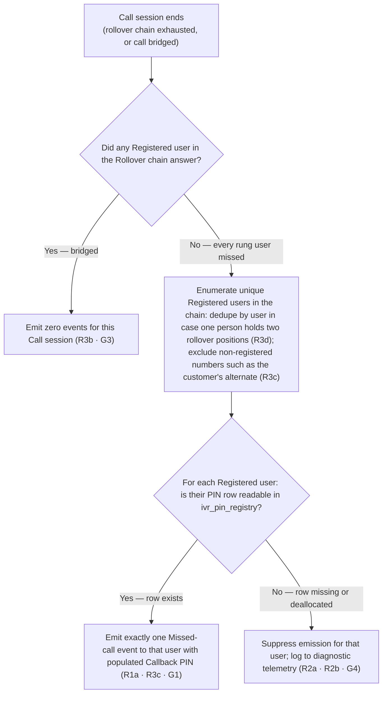

# IVR Missed Call Alert — add PIN to the callback SMS

| | | | |
|---|---|---|---|
| **Owner** — Ashish Raj (PM, IVR) | **Reviewer** — Rahul (Eng Lead) | **Status** — Draft | **Sign-off** — Pending |
| **Version** — v2.0 · 2026-09-29 | **Consulted — IVR service** — Rahul | **Consulted — Message orchestrator** — Ashish Raj (self) | **Consulted** — — |
| **Terminology source** — Wiom Operational Terminology · 29 Sep 2026 · Wiom System Terminology · 29 Sep 2026 | | | |

> **v2.0 note.** This document re-authors the signed-off v1.0 (11 Sep 2026) into Wiom PRD Template v5. Structural changes: v5 sections, one §5 diagram, no §3b state table, no §6 Measurement. Terminological changes: Wiom Operational Terminology alignment — **Task** replaces "ticket" in prose; identifiers such as `ticket_id` and `ticket_type` stay verbatim per rule 9. Scope change from v1.0: `retry_count` handling is removed — that feature was deprioritised and does not exist in prod, so the R3d dedupe-across-`retry_count`-copies obligation and its ACs are gone; only the general per-user dedup invariant remains, covering the rare same-person-in-two-rollover-positions case. See the tradeoffs register for the full change log.

---

## 1. Terminology Used

The Wiom Operational Terminology and Wiom System Terminology govern all shared terms. The rows below cover only what those files do not: feature-coined terms and IVR-service concepts referenced repeatedly in this document.

| Term | Meaning | Owner (domain) |
|---|---|---|
| IVR 2.0 | The parent feature this spec extends. Introduces the single **masked calling** DID architecture with **Callback PIN** routing and multi-number **Rollover chain**. This spec adds one field to two of its events. | IVR service |
| Masked calling DID | The single Wiom-owned number that customers and CSPs dial to reach each other via masked calling. | IVR service |
| Missed-call event | The CleverTap event fired at end of a **Call session** in which no callee answered, once per **Registered user** in the chain who has a readable **Callback PIN**. Two identifier variants: `dnp_customer_missed_call_alert` (customer-app recipient) and `call_dnp_missed_call_alert` (CSP-app recipient). Never fires on any answered call. Never fires more than once per Registered user per session. Never fires without a populated Callback PIN in the payload. | IVR service |
| Call session | One caller-initiated dial of the Masked calling DID, including its full **Rollover chain**. The unit at which emission is decided. | IVR service |
| Rollover chain | The ordered list of numbers the Exotel Connect applet is asked to dial in one Call session. Customer-initiated: assigned **Technician** → CSP **Admin** (labelled *Manager* in the chain) → **CSP** owner (labelled *Owner* in the chain), up to three positions. CSP-initiated: the customer's primary registered number → the customer's alternate number, up to two positions. | IVR service |
| Registered user | A **Customer** or CSP-side app user (Admin or Technician) whose registered mobile number appears in the Rollover chain. Alternate numbers and hand-typed numbers with no app install behind them are not Registered users and never receive a Missed-call event. | IVR service |
| Callback PIN | The PIN value from `ivr_pin_registry` for the callee's own side of the Task the Call session was about. When the callee later dials the Masked calling DID and enters this PIN, IVR 2.0 bridges them back to the counterparty they missed. | IVR service |
| PIN visibility flag | Shorthand for the `visible` column on `ivr_pin_registry`. It gates whether a call is routed via masked calling at all: `true` → the call is IVR; `false` → the call is routed through the normal (non-IVR) path and the Missed-call events defined here do not exist for that call. This spec assumes every emission path is under `visible = true` and does not re-check the flag at emit time. | IVR service |
| SMS campaign | The downstream **Message orchestrator** campaign that consumes the Missed-call event and dispatches an SMS to the callee. Content, template, DLT registration and delivery rules of this SMS are out of scope of this PRD (see §2 Boundary). | Message orchestrator |

---

## 2. Objective & Guardrails

**Objective.** When a Call session misses, every Registered user in the Rollover chain who was rung and did not answer receives an SMS containing the callback number and their own Callback PIN, so they can dial back in one shot without hunting for the PIN in their chat or task card.

**Boundary.** This spec governs (a) the payload of the two Missed-call events (`dnp_customer_missed_call_alert`, `call_dnp_missed_call_alert`) fired at end of a Call session per §5, and (b) the recipient-scope rules stated in G3 and G4. Out of scope: (i) the SMS content, template, DLT registration and delivery rules — those live with the SMS campaign in the Message orchestrator; (ii) the Rollover chain mechanics — that lives in IVR 2.0; (iii) any push-notification behaviour beyond the event firing; (iv) any other CleverTap event; (v) any change to `ivr_pin_registry` schema or how the Callback PIN is generated or made visible; (vi) any app UI change. If this ships and an existing consumer of these two events breaks because a previously-present field is missing or renamed, that broke (AC-REG-1, G1).

**IVR calling origin — informational.** The Masked calling DID is reached by three paths today. The rules in this document apply identically across them; the origin does not change the payload or the recipient set.
- **P1 — In-app CTA.** The caller taps the call button inside the customer app, the CSP app or the app the Technician uses; the app dials the Masked calling DID.
- **P2 — Dialer, single active Task.** The caller dials the Masked calling DID directly; because they have exactly one active Task, no PIN is required and the IVR service routes on caller identity.
- **P3 — Dialer, PIN required.** The caller dials from an unknown number or has multiple active Tasks, so the IVR service prompts for the Callback PIN before routing.

### Guardrails — promises that hold on every path

| ID | Guardrail | One line | Anchors |
|---|---|---|---|
| G1 | **Existing event contract preserved** *(zero tolerance)* | Every field the two events carry today is still present in the payload, with the same name, type and semantics. This spec is additive only. | R1 · AC-R1-1 · AC-REG-1 |
| G2 | **IVR 2.0 functionality preserved** | The trigger, timing and destination of the two events, the downstream push-notification pipeline, and every other IVR 2.0 behaviour continue exactly as they do today. This spec is a pure payload extension. | R1 · AC-REG-1 · AC-REG-2 |
| G3 | **One event per Registered user per Call session, never on pickup** | If any user in the chain answered, zero events fire for the session. If no user answered, exactly one event fires per Registered user in the chain. | R3 · AC-R3-1 · AC-R3-2 · AC-R3-3 · AC-R3-4 · AC-GRD-1 |
| G4 | **No Missed-call event without a populated Callback PIN** | Every emitted event carries a populated Callback PIN. If the PIN row is missing or deallocated at emit time (a defensive edge that should not occur in practice), the emission is suppressed rather than fired with an empty PIN — a PIN-less SMS is useless, and a deallocated PIN cannot bridge a callback. | R2 · AC-R2-1 · AC-R2-2 · AC-GRD-2 |

---

## 3. Stories, Rules & Acceptance Criteria

### R1 — Attach the callee's Callback PIN to the event payload

| ID | Story | MUST | MUST NOT |
|---|---|---|---|
| R1 | As a Customer or CSP-side user who missed a call about my active Task, I want the callback SMS to include the Callback PIN alongside the callback number, so I can dial back in one shot. | **(a)** Include the callee's own Callback PIN in the event payload — as `customer_pin` on the customer-side event and as `csp_pin` on the CSP-side event — sourced from `ivr_pin_registry` for the Task the missed call was about, matched to the callee's side (customer-side row for the customer event; CSP-side row for the CSP event). **(b)** Emit the event within the same latency envelope the event has today; no change to the event's trigger, timing or destination. | Add, rename or remove any existing field on either event. Change any observable event behaviour beyond the PIN payload addition. |

| AC | Given / When / Then | Verifies | Status |
|---|---|---|---|
| AC-R1-1 | **Given** an active Service task where the customer-side row in `ivr_pin_registry` has `pin = 234491` and `visible = true`, **When** a CSP-side user calls the customer through the Masked calling DID and the customer does not answer any number in the Rollover chain, **Then** the `dnp_customer_missed_call_alert` event on CleverTap carries every field it carried before this spec plus one new field `customer_pin = "234491"`. | R1a · G1 | Settled |
| AC-R1-2 | **Given** an active Service task where the CSP-side row in `ivr_pin_registry` has `pin = 087275` and `visible = true`, **When** the customer calls the CSP through the Masked calling DID and no user in the CSP-side Rollover chain answers, **Then** the `call_dnp_missed_call_alert` event on CleverTap carries every field it carried before this spec plus one new field `csp_pin = "087275"`. | R1a · G1 | Settled |
| AC-R1-3 | **Given** the setup of AC-R1-1, **When** the event lands on CleverTap, **Then** the `customer_pin` value in the payload is byte-for-byte identical to the `pin` column of the customer-side `ivr_pin_registry` row for the Task the missed call was about, read at the moment the event was constructed. | R1a | Settled |

### R2 — Suppress the event when the Callback PIN cannot be attached

| ID | Story | MUST | MUST NOT |
|---|---|---|---|
| R2 | As the Wiom Ops team monitoring the IVR service, I want the Missed-call event suppressed when the Callback PIN cannot be attached, because a PIN-less SMS is useless to the callee and a deallocated PIN cannot bridge a callback anyway. | **(a)** When no `ivr_pin_registry` row exists for the callee's side of the Task at emit time (data anomaly), emit zero events for that callee and record the suppression in diagnostic telemetry. **(b)** When the row was deallocated between Call session start and emit time (racy but possible), same behaviour: zero events, log the suppression. **(c)** Do not raise or crash — treat suppression as a normal branch that yields zero events; other callees in the same Call session are unaffected. | Emit the event with an empty PIN field. Emit any surrogate or placeholder value in the PIN field to work around a missing row. |

| AC | Given / When / Then | Verifies | Status |
|---|---|---|---|
| AC-R2-1 | **Given** an active Install task where no `ivr_pin_registry` row exists for the callee's side at the moment the Missed-call event would fire (data anomaly), **When** the callee does not answer the call, **Then** no Missed-call event lands on CleverTap for that callee; the suppression appears in diagnostic telemetry split by side (customer / CSP) and by reason (row missing); no exception propagates to any other callee's emission in the same Call session. | R2a · G4 · G2 | Settled |
| AC-R2-2 | **Given** an active Service task where the callee's `ivr_pin_registry` row is deallocated between Call session start and the emit moment, **When** the callee does not answer, **Then** no Missed-call event lands on CleverTap for that callee; the suppression appears in diagnostic telemetry with reason "row deallocated"; no exception propagates. | R2b · G4 · G2 | Settled |

### R3 — Fire exactly one event per Registered user per Call session, never on pickup

| ID | Story | MUST | MUST NOT |
|---|---|---|---|
| R3 | As a callee who missed the call, I want one callback SMS for that call — not several. | **(a)** Evaluate emission once per Call session, at end of session, covering every position in the Rollover chain. **(b)** If any Registered user in the chain answered, emit zero events for the session. **(c)** If no Registered user answered, emit exactly one event per Registered user in the chain, each on that user's own registered mobile number; non-registered numbers in the chain (the customer's alternate number, hand-typed numbers) do not receive a Missed-call event. **(d)** Dedupe by Registered user across the chain: if the same person appears in two rollover positions (e.g. a Technician who is also the CSP owner in a single-person CSP), that person receives at most one event for the session. | Emit a Missed-call event to any non-registered number in the Rollover chain. Emit more than one event to the same Registered user in one Call session. Emit any event when the Call session was answered. |

| AC | Given / When / Then | Verifies | Status |
|---|---|---|---|
| AC-R3-1 | **Given** a customer-initiated Call session where the CSP-side Rollover chain rings Technician → Manager → Owner (three Registered users), and the Manager answers on the second rollover position, **When** the Call session ends, **Then** zero `call_dnp_missed_call_alert` events land on CleverTap for that session, and zero `dnp_customer_missed_call_alert` events land on CleverTap for that session. | R3b · G3 | Settled |
| AC-R3-2 | **Given** a customer-initiated Call session where the CSP-side Rollover chain rings Technician → Manager → Owner (three Registered users with distinct `csp_pin` values), and no user answers any of the three dial attempts, **When** the Call session ends, **Then** exactly three `call_dnp_missed_call_alert` events land on CleverTap — one to each of Technician, Manager and Owner on their own registered mobile number — each carrying the recipient's own `csp_pin`; zero `dnp_customer_missed_call_alert` events land for that session. | R3c · G3 | Settled |
| AC-R3-3 | **Given** a CSP-initiated Call session whose Rollover chain is the customer's primary registered number followed by the customer's alternate number (one Registered user plus one alternate number with no app install), and neither number answers, **When** the Call session ends, **Then** exactly one `dnp_customer_missed_call_alert` event lands on CleverTap, on the customer's primary registered number, with `customer_pin` populated from the customer-side `ivr_pin_registry` row; no Missed-call event is directed at the alternate number. | R3c · G3 | Settled |
| AC-R3-4 | **Given** a single-person CSP where the same person occupies both the Technician and the CSP-owner (Owner) positions in the Rollover chain — the chain therefore lists the same registered mobile number twice — **When** the person does not answer either attempt, **Then** exactly one `call_dnp_missed_call_alert` event lands on CleverTap for that person, carrying their `csp_pin`. | R3d · G3 | Settled |

---

## 4. Cross-cutting Acceptance Criteria

| AC | Given / When / Then | Verifies | Status |
|---|---|---|---|
| AC-WF-1 | **Given** a customer with an active Service task, customer-side `pin = 234491`, `visible = true`, **When** a CSP-side user calls the customer through the Masked calling DID and no number in the customer-side Rollover chain answers, **Then** the `dnp_customer_missed_call_alert` event carrying `customer_pin = "234491"` lands on CleverTap; the downstream SMS campaign (out of scope) can bind to `customer_pin` and deliver the SMS with the callback number and the PIN. | R1a · G1 · G2 | Settled |
| AC-WF-2 | **Given** a customer-initiated Call session to a CSP whose Rollover chain is Technician → Manager → Owner (three Registered users with distinct `csp_pin` values), **When** none of the three dial attempts is answered, **Then** exactly three `call_dnp_missed_call_alert` events land on CleverTap — one per Registered user, on their own registered mobile number, each carrying the recipient's own `csp_pin`; the downstream SMS campaign can deliver three SMSes, one per Registered user, each with the callback number and the recipient's own PIN; zero customer-side events land for that session. | R1a · R3c · G3 | Settled |
| AC-WF-3 | **Given** a Call session originated via **P1 — in-app CTA** (the caller tapped the call button on an active Install task inside the customer app), **When** the callee does not answer and the callee's `ivr_pin_registry` row is readable, **Then** the Missed-call event fires under the same rules as any other origin — origin does not change the payload, the recipient set, or the Callback PIN invariant. | R1a · G3 · G4 | Settled |
| AC-WF-4 | **Given** a Call session originated via **P2 — dialer, single active Task** (the caller dialled the Masked calling DID directly with exactly one active Task, so no PIN prompt ran on the caller side), **When** the callee does not answer and the callee's `ivr_pin_registry` row is readable, **Then** the Missed-call event fires under the same rules — the absence of a caller-side PIN prompt does not affect the callee-side event. | R1a · G3 · G4 | Settled |
| AC-WF-5 | **Given** a Call session originated via **P3 — dialer, PIN required** (the caller dialled from an unknown number or with multiple active Tasks, entered the Callback PIN when the IVR service prompted, and was routed), **When** the callee does not answer and the callee's `ivr_pin_registry` row is readable, **Then** the Missed-call event fires under the same rules — the caller-side PIN authentication does not affect the callee-side event's payload or the recipient set. | R1a · G3 · G4 | Settled |
| AC-FAIL-1 | **Given** an active Task where the callee's `ivr_pin_registry` row is missing at emit time, **When** the callee does not answer, **Then** the customer-facing envelope is: no SMS is sent for that callee and no exception surfaces to the caller or the callee — the failure is contained to a diagnostic entry (see AC-R2-1). | R2a · R2c · G4 | Settled |
| AC-REG-1 | **Given** a missed call under any scenario covered in §3 or §4, **When** the `dnp_customer_missed_call_alert` or `call_dnp_missed_call_alert` event lands on CleverTap, **Then** the full set of fields present in that event before this spec is still present, unchanged in name, type and semantics; the only addition is the new PIN field (`customer_pin` or `csp_pin`). | G1 · G2 | Settled |
| AC-REG-2 | **Given** any missed call, **When** the event fires, **Then** the event's trigger condition, latency envelope and CleverTap destination are unchanged from before this spec; the push-notification pipeline downstream of CleverTap continues to fire the notifications it fires today. | G2 | Settled |
| AC-GRD-1 | **Given** any Call session, **When** the session's emissions are inspected against §3 R3 and §5, **Then** the emitted count matches G3: zero if any Registered user answered, exactly one per unique Registered user rung if none answered. | G3 | Settled |
| AC-GRD-2 | **Given** any emitted Missed-call event, **When** its payload is inspected, **Then** the PIN field (`customer_pin` or `csp_pin`) is populated with a non-empty PIN string sourced from `ivr_pin_registry`; no event lands on CleverTap with the PIN field empty or absent. | G4 | Settled |
| AC-DUP-1 | **Given** a caller who dialled the Masked calling DID twice — a first Call session ending at 10:05 with no pickup, a second Call session ending at 10:12 with no pickup, both about the same active Task — **When** both sessions have completed, **Then** each Call session is evaluated independently: two separate Missed-call events land on CleverTap for the same callee (one per session), and neither session's emission decision affects the other. | R3a · G3 | Settled |

---

## 5. System Behaviour

**Lifecycle test:** persists no · two or more named statuses no · moved later no → **decision flowchart**.

*Reason.* The Missed-call event emission is a single decision taken at end of a Call session, evaluated once, then done. Nothing outlives the request; nothing has a status that a person or a later event moves. There is no entity with a lifecycle to draw — a state diagram here would be fabricated structure.

The decision below is evaluated once per Call session ended, per Registered user in the Rollover chain. The Call session, the push-notification cascade downstream of CleverTap, and the SMS campaign are neighbouring lifecycles out of scope.

**Precondition.** This decision only runs for calls that were IVR at all. A Task with `visible = false` on its `ivr_pin_registry` row is routed through the normal (non-IVR) path and this decision does not exist for that Task. Every branch below therefore assumes the PIN visibility flag was `true` at Call session start; the flag is not re-checked at emit time.

**Precedence.** Diamond B is evaluated before diamond D — a Call session that reached diamond B with "yes" never reaches diamond D. Within a "no pickup" session, diamond D is evaluated per Registered user independently: one user's missing row does not affect another user's emission.

**Undecided behaviour.** None. Every branch above is decided.

---

## 6. Configurability

No parameters. This spec introduces no numbers — no clocks, limits, thresholds or amounts. Behaviour is deterministic once the payload change ships: for each Call session ended, the flow chart in §5 decides zero events (any pickup) or one event per Registered user (no pickup, PIN row readable).

---

## 7. Impacted Systems & References

| System / Service | Impact | Reference material | What was checked · ACs grounded on it |
|---|---|---|---|
| IVR service | Writes: emits the two Missed-call events with the new PIN field. Reads: the callee-side row in `ivr_pin_registry` at emit time. | Prod IVR service (`prod-ivr-service-v2`); repo `github.com/marutsinghwiom/ticket-service-java` (`com.wiom.userconnection.*`). Event names: `dnp_customer_missed_call_alert`, `call_dnp_missed_call_alert`. | Confirmed the two events fire today at end of a Call session with no pickup, keyed to the callee's app side. Existing payload field list is the baseline for AC-REG-1. Emission is at end-of-session, not per Exotel leg — confirmed for the Rollover chain cases in AC-R3-2, AC-R3-3, AC-R3-4. | AC-R1-1 · AC-R1-2 · AC-R1-3 · AC-R2-1 · AC-R2-2 · AC-R3-1 through AC-R3-4 · AC-REG-1 · AC-REG-2 |
| `ivr_pin_registry` table (in `ivr_db`) | Reads: for each Registered user in the chain, the row keyed by side (customer or CSP), Task and user. Unchanged by this spec. | Schema extract: `id`, `pin` (character), `user_id`, `execution_candidate_id`, `number`, `type` (CUSTOMER / CSP), `pin_status` (ALLOCATED / DEALLOCATED), `ticket_type` (INSTALL / RESTORE / NBREC), `ticket_id`, `csp_id`, `visible` (boolean), `allocated_at`, `deallocated_at`. | Confirmed the `pin` field is the value the SMS campaign will bind to. Confirmed `visible = true` gates whether the call is IVR at all (§2 precondition). Confirmed the row can be missing or deallocated at emit time in edge scenarios. | AC-R1-3 · AC-R2-1 · AC-R2-2 |
| CleverTap (Message orchestrator platform) | Receives: the two enriched Missed-call events. Downstream: the SMS campaign will bind to the new PIN field. | CleverTap event catalogue for the two names above. | Confirmed the two event names are live and consumed by the downstream push-notification pipeline. This spec adds one field; the downstream SMS campaign work (bind, template, delivery) lives elsewhere. | AC-REG-1 · AC-REG-2 · AC-WF-1 · AC-WF-2 |
| IVR 2.0 (feature within IVR service) | Owns: the Rollover chain (Sept 2 2026 release). This spec depends on it but does not change it. | IVR 2.0 spec `csp-ivr-service-product-spec` in the IVR-Routing-Solutioning repo (superseded by the live spec state noted in the memory index). | Confirmed the Rollover chain positions are Technician → Manager → Owner (customer-initiated) and Customer primary → alternate (CSP-initiated). Confirmed no other duplication source in the numbers array in prod today. | AC-R3-2 · AC-R3-3 · AC-R3-4 |

---

## 8. Notes for System Capabilities

| Capability | Needed by |
|---|---|
| At Missed-call event construction, read the callee-side row in `ivr_pin_registry` for the Task the Call session was about (customer-side row for the customer event; CSP-side row for the CSP event). | R1a · R2a · R2b |
| Include the Callback PIN value as a new field on the event payload — `customer_pin` on the customer-side event, `csp_pin` on the CSP-side event — without altering any existing field. | R1a · G1 |
| Suppress the emission (emit zero events for that callee) when the callee's `ivr_pin_registry` row is missing or deallocated at emit time, without raising to the caller, the callee, or any other emission in the same Call session. | R2a · R2b · R2c · G4 |
| Emit diagnostic telemetry when the suppression branch fires — split by event side (customer / CSP) and by reason (row missing vs row deallocated). Expected steady-state count is zero; a non-zero value is an operational alarm because a deallocated PIN should have blocked the call from bridging in the first place. | R2 · G4 |
| Evaluate emission at the end of the Call session (after every rollover position has been dialled or the call has bridged), not per Exotel leg. Determine whether any Registered user in the chain answered before entering the per-user branch. | R3a · R3b · G3 |
| Enumerate the set of Registered users in the Rollover chain: deduplicate by user in case the chain lists the same person more than once; exclude non-registered numbers (the customer's alternate number and hand-typed numbers with no app install). Emit exactly one event per user in this set on their own registered mobile number. | R3c · R3d · G3 |

---

## Overrides

| Rule overridden | What was done instead | Rationale | Approved by |
|---|---|---|---|
| Template v5 §5 requires a lifecycle-test-driven diagram; a state diagram is preferred where lifecycle passes | This document uses a decision flowchart (lifecycle test fails: no persistence, no named statuses, no later move) | The Missed-call event emission is a single end-of-session decision; there is no entity with a lifecycle to draw. The flowchart carries all routing (R-ids only, no Tn) as v5 mandates for a stateless feature. | Ashish Raj (PM) · 2026-09-29 |
| Template v5 §6 assumes at least one parameter row (Fixed or Configurable) | §6 states "No parameters" | This spec introduces no numbers — no clocks, limits, thresholds or amounts. There is nothing to record. | Ashish Raj (PM) · 2026-09-29 |
| Template v5 has no §6 Measurement section; v1.0 carried MQ-ids (measurement questions) | v1.0's MQ-1, MQ-2, MQ-3 are re-expressed as observability capabilities in §8 rather than a separate measurement block | Template v5 leaves instrumentation to the implementer, exposed as capabilities. The three v1 MQs (suppression counter, contract-preservation audit, per-session emission count) all fit that shape. | Ashish Raj (PM) · 2026-09-29 |
| Template v5 assumes a fresh interview | This document re-authors v1.0 (signed off 11 Sep 2026) into v5 rather than re-interviewing | Every substantive decision was closed during the v1.0 passes; the v2 change set is structural and terminological. The tradeoffs register carries the v1.0 decisions forward and adds this re-authoring as row 10. | Ashish Raj (PM) · 2026-09-29 |
